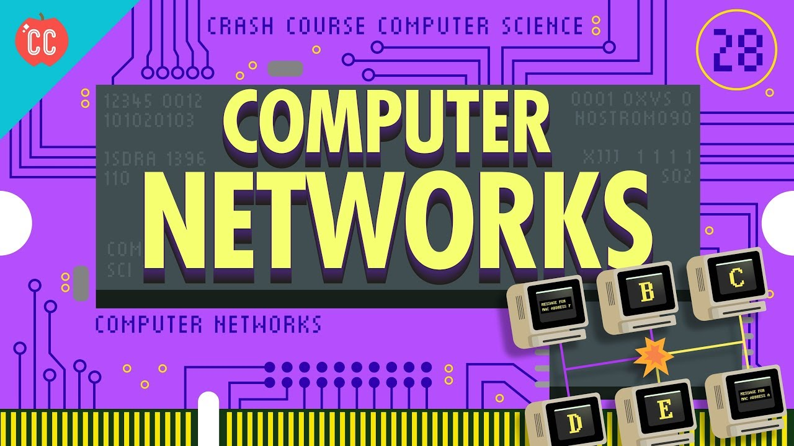
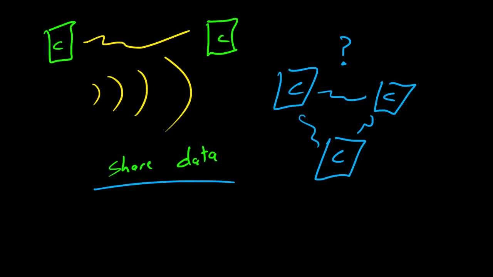

# Digital Networks
###### Created by: Parker Hansen

---

**Purpose:** This tutorial can be used to learn about the workings of digital networks and help users realize and understand the networks they use everyday.
 **Target Audience:** The content included does not require any past exposure to any content but will be useful for someone who is comfortable with technology. More geared towards high school age and up students.

<tab>
<table>
  <tr>
    <td>
      <h3><a href="basic.md">Basic Concepts</a></h3>
    </td>
    <td>
      <h3><a href="how.md">How are Networks Created?</a></h3>
    </td>
    <td>
      <h3><a href="osi.md">The OSI Model</a></h3>
    </td>
    <td>
      <h3><a href="Security.md">Error Detection</a></h3>
    </td>
  </tr>
</table>

Videos to watch:

