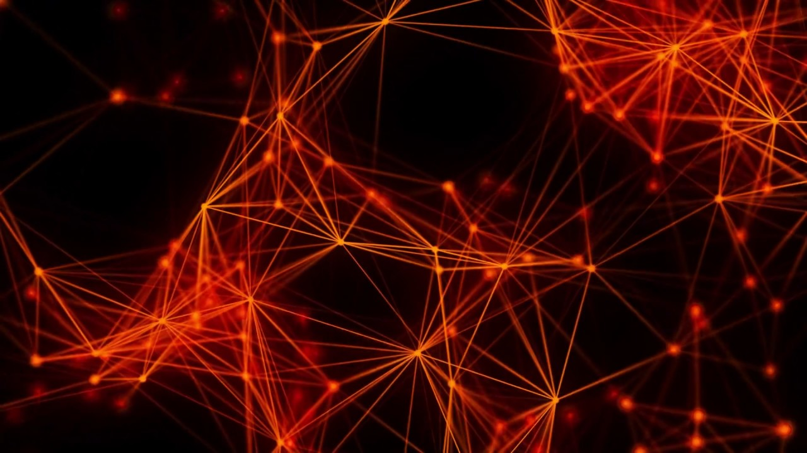

# Digital Networks
###### Created by: Parker Hansen

---

**Purpose:** This tutorial can be used to learn about the workings of digital networks and help users realize and understand the networks they use everyday.
 **Target Audience:** The content included does not require any past exposure to any content but will be useful for someone who is comfortable with technology. More geared towards high school age students.

<tab>
<table>
  <tr>
    <td>
      <h3><a href="basic.md">Basic Concepts</a></h3>
    </td>
    <td>
      <h3><a href="Local.md">How are Networks Created?</a></h3>
    </td>
    <td>
      <h3><a href="osi.md">The OSI Model</a></h3>
    </td>
    <td>
      <h3><a href="Security.md">Security and Errors</a></h3>
    </td>
  </tr>
</table>

### <a name="what"> What is a Digital Network?
A digital network is the connections between devices that allow for communication between each other. As technology has evolved since the introduction of computers these links can either be physical cables (such as ethernet cables) or wirelessly. The devices are usually referenced to as "nodes" in the context of digital networks.
