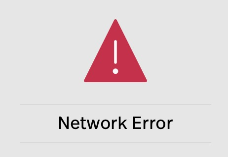

## Error Detection

[Back](README.md)

---

---

#### Contents

1. [How do digital networks detect errors?](#how)
     - [Parity Checking](#parity)
     - [Checksums](#checksums)

 

---

## <a name="how"> How do digital networks detect errors?
When sending data over a network there are situations, pretty much all the time, where it is very important that the data received on the other end is complete and identical to information transmitted. Thus digital networks need to have the ability to check if the data being transmitted is received completely. Computers and digital networks thus have all kinds of ways of checking the information they send.

One of the most simple checks is sending the data twice and comparing the data received to see if they are identical, if they aren't then they ask for the data to be re-sent. But since it very inefficient there are other methods. Below are just some examples of methods of detecting errors.

### <a name="parity"> Parity Checking
One of the simplest methods of detecting errors is parity checking. When sending a string of binary digits (bits made up of zeros and ones) over a network the number of bits are counted. If an odd number of bits are sent you send an extra 1 to confirm that you are sending an odd number of bits., if an even number of bits are send you send an extra 0 to confirm that you are sending an even number of bits.

When the receiver gets the data they also count the number of bits you have sent then check it against the parity bit. If it doesn't match then the network knows an error has occurred. A disadvantage of this method is that where the error occurred is ambiguous and thus cannot correct it but would ask for the sender to send the information again.

### <a name="checksums"> Checksums
More sophisticated ways of detecting errors are usually variants of checksums where, every so often, you add together the numbers you've previously sent and then transmit the total (the sum) as a check. The receiver does the same calculation and compares it with the checksum.
