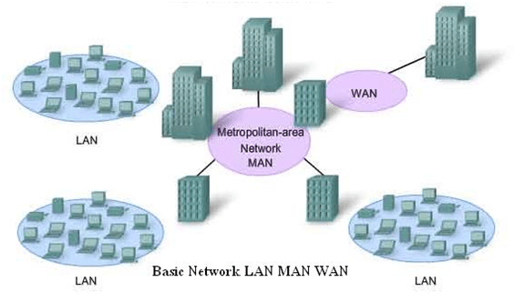

# <a name="top"> Types of Networks

[Back](README.md)

#### Contents
* [Personal Area Network (PAN)](#PAN)
* [Local Area Networks (LAN)](#LAN)
* [Metropolitan Area Networks (MAN](#MAN)
* [Wide Area Networks (WAN](#WAN)

 

 

---

Even though all networks work based off the same basic principals they are not all the same. Below I am going to explain some commonly used networks.

### <a name="PAN"> Personal Area Network (PAN)
You can observe a personal area networks right in your home. The connections between your computers, printers, smartphones, tablets, and other "smart-devices" that are in your home compromise your own personal area network. These connections can be either physical, through cables, or wirelessly over your home wifi and usually the device connecting them all is a router (example pictured below).

### <a name="LAN"> Local Area Networks (LAN) 
Chances are you have heard the term LAN when you are trying to communicate with your internet service provider or trying to connect to wifi. Local area networks connect devices within a limited area. For example these areas could be residences, schools, or offices.
  The connection between these devices can possibly have a single connection to the internet, within you home this connection happens usually at a modem (example pictured below). While there is also a router, the difference between these two peripherals is that the router connects the devices while the modem connects the devices to the internet service provider.

### <a name="MAN"> Metropolitan Area Networks (MAN) 
Going up in scale, a metropolitan area network (MAN) can cover an entire town or city as apposed to a limited specific area with a LAN. Thus it implies that a MAN connects all the networks in a city to a larger network.

### <a name="WAN"> **Wide Area Networks (WAN)** 
Even larger than a metropolitan area network there are wide area networks (WAN). By definition a WAN covers over a large geographical distance or place. Companies, research institutions, and governments frequently use WANs to communicate across the world, and one could consider the internet to be a WAN.

This image is a good recap of what was explained above:

---

### <a name="how"> How are Networks Created?

---

### <a name="osi"> The OSI Model
