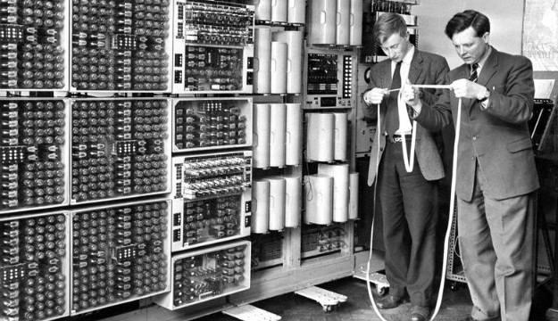

# Basic Concepts of Digital Networks

[Back](README.md)

#### Contents
* [What is a Digital Network?](#### What is a Digital Network)
* Types of Networks
* How are Networks Created?
* The OSI Model

#### What is a Digital Network?
A digital network is the connections between devices that allow for communication between each other. As technology has evolved since the introduction of computers these links can either be physical cables (such as ethernet cables) or wirelessly.
