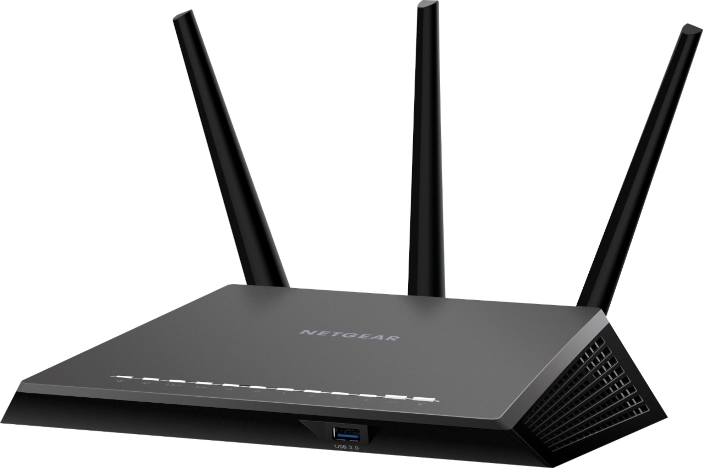

# <a name="top"> Basic Concepts of Digital Networks

[Back](README.md)

#### Contents
* [What is a Digital Network?](#what)
* [Types of Networks](#types)
* [How are Networks Created?](#how)
* [The OSI Model](#osi)

 

 

---

 

### <a name="what"> What is a Digital Network?
A digital network is the connections between devices that allow for communication between each other. As technology has evolved since the introduction of computers these links can either be physical cables (such as ethernet cables) or wirelessly. The devices are usually referenced to as "nodes" in the context of digital networks.

---

### <a name="types"> Types of Networks
Even though all networks work based off the same basic principals they are not all the same. Below I am going to explain some commonly used networks.

**Personal Area Network (PAN)** 
You can observe a personal area networks right in your home. The connections between your computers, printers, smartphones, tablets, and other "smart-devices" that are in your home compromise your own personal area network. These connections can be either physical, through cables, or wirelessly over your home wifi and usually the device connecting them all is a router (example pictured below).

**Local Area Networks (LAN)** 
Chances are you have heard the term LAN when you are trying to communicate with your internet service provider or trying to connect to wifi. Local area networks connect devices within a limited area. For example these areas could be residences, schools, or offices.
  The connection between these devices can possibly have a single connection to the internet, within you home this connection happens usually at a modem (example pictured below). While there is also a router, the difference between these two peripherals is that the router connects the devices while the modem connects the devices to the internet service provider.

**Metropolitan Area Networks (MAN)** 

**Wide Area Networks (WAN)** 

---

### <a name="how"> How are Networks Created?

---

### <a name="osi"> The OSI Model
