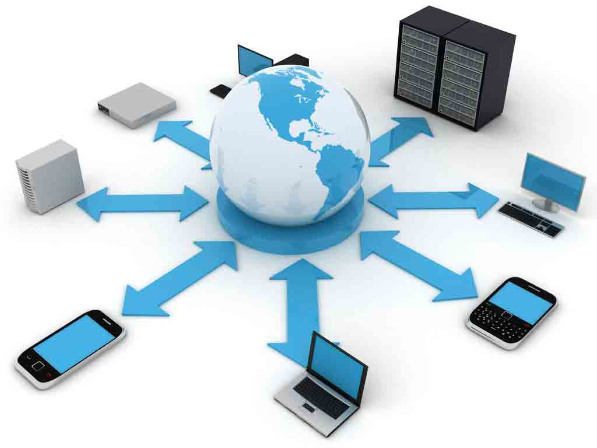

## How are Networks Created?

[Back](README.md)

---

---

#### Contents
1. [Network Hubs and Switches](#net)
2. [What Makes a Network?](#what)

 

---

## <a name="net"> Network Hubs and Switches
When computers where connected by ethernet cables to create a network, there needed to be a way to connect many computers instead of just two connected by a cable. Thus **hubs** came to be, all ethernet cables would converge at the hub from all computers allowing for information to be shared across all computers.

One downside of hubs is that if a lot of computers are trying to send information/data through the hub it can slow down the data transmission dramatically. To solve this problem a **switch** is put in place. Using the IP connected with where the data is supposed to be sent, the switch directs the data to that exact computer.

---

## <a name="what"> What Makes a Network?
